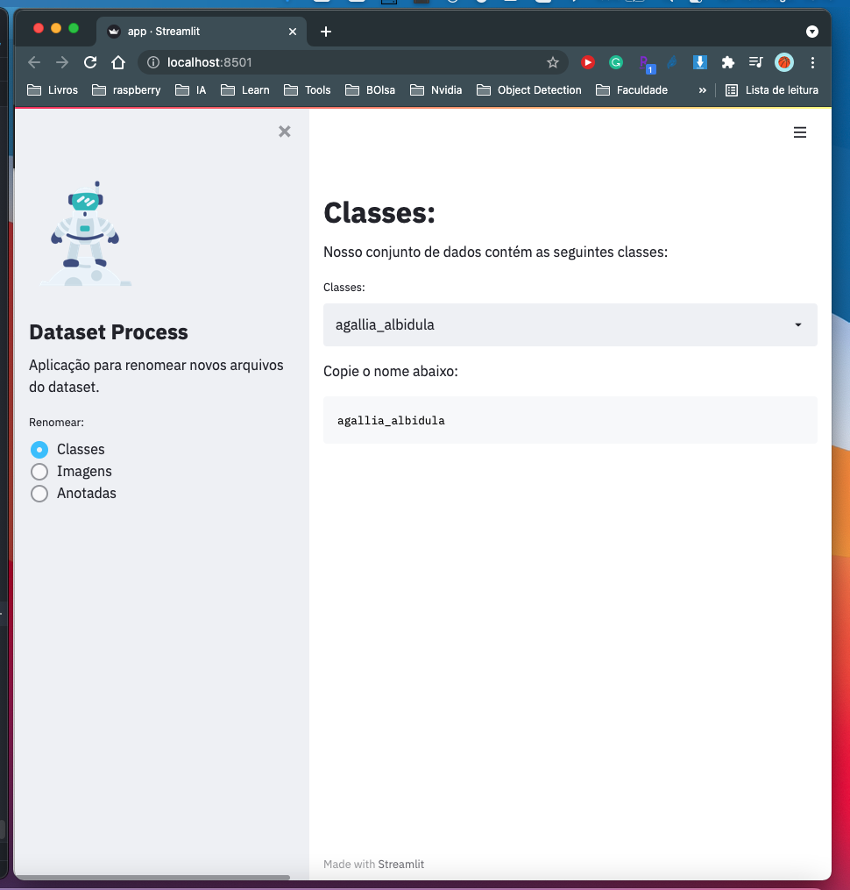
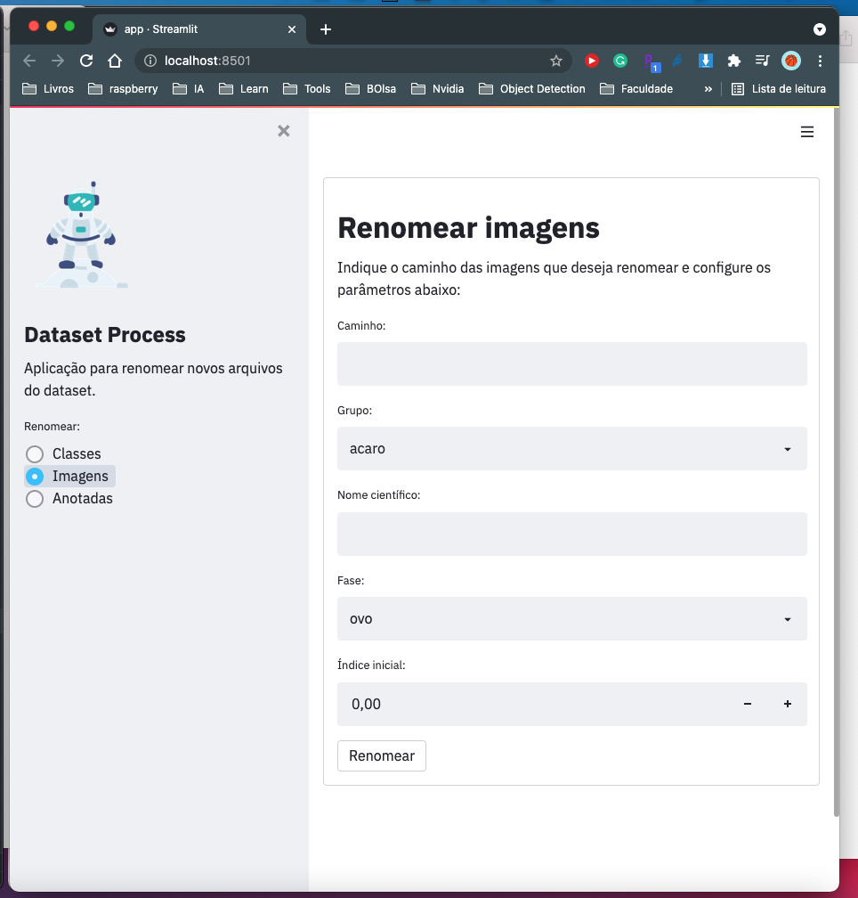
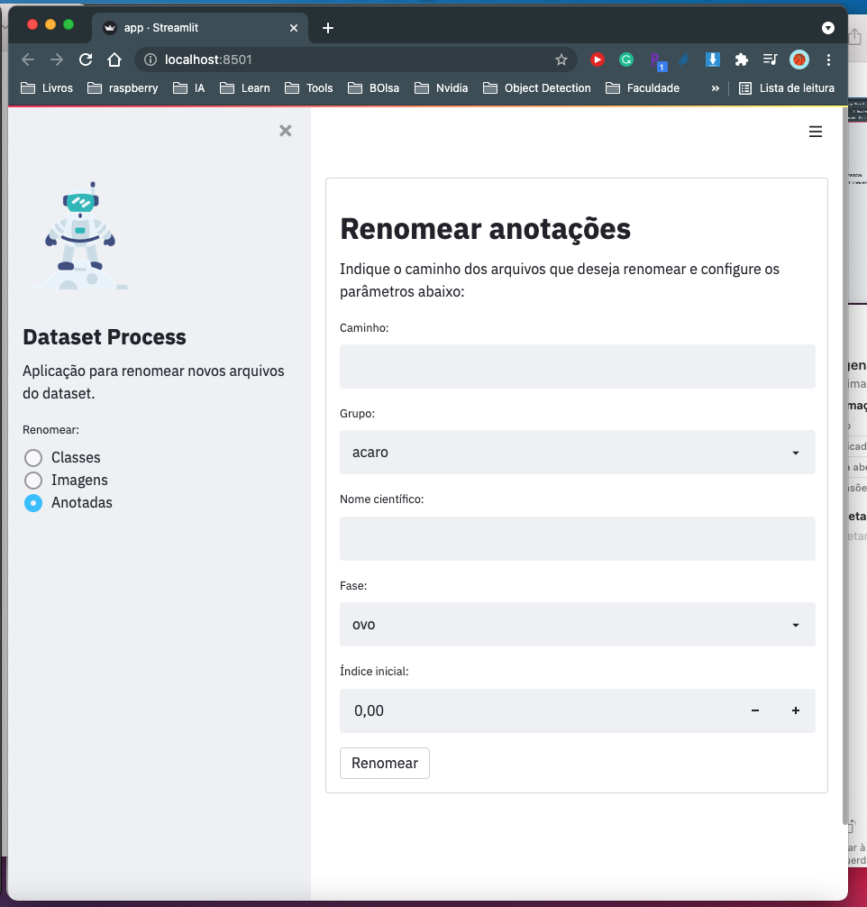

## rename-files

Aplicativo para renomear imagens e anotações feitas pela ferramenta **LabelMe**.

**Para rodar o aplicativo execute os seguintes comenados:**

1 - Instalar bibliotecas:

    pip install -r requirements.txt

2 - Rodar o aplicativo:

    streamlit run app.py

3 - Acesse o seguinte link (por padrão abre automaticamente):

    http://localhost:8501/

**Será exibida  a seguinte tela:**

**Renomear apenas imagens:**

**Renomear imagens e anotações:**

